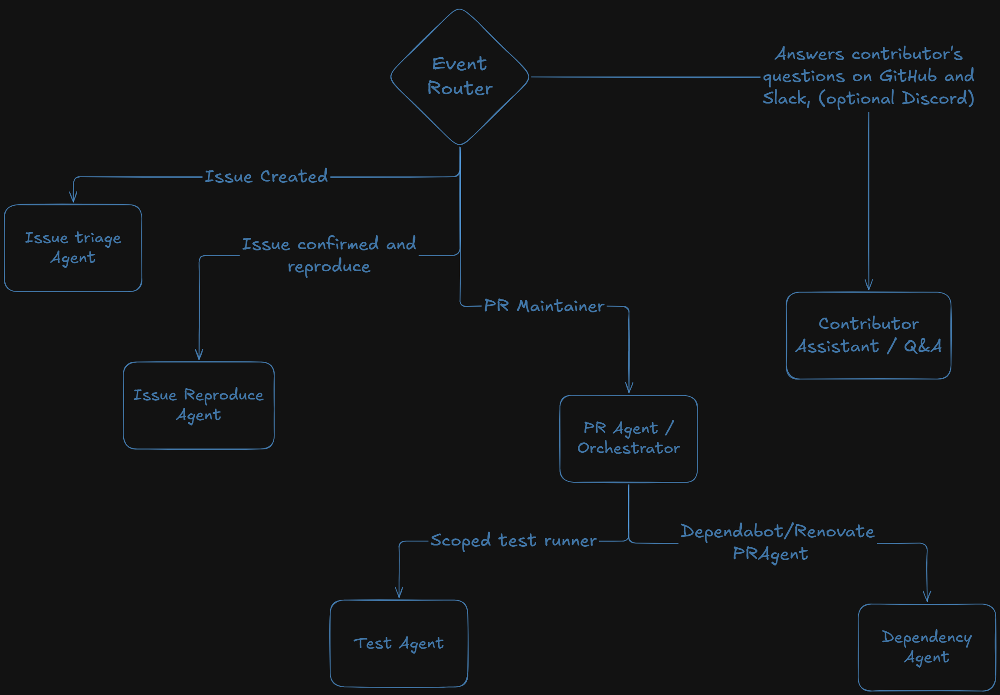

# OpenMaintainer

OpenMaintainer is a team of Autonomous AI Agents that automates routine repository maintenance.

It helps maintainers reduce repetitive work such as triaging issues, answering common contributor questions, and handling dependency updates, while keeping repository actions controlled by maintainer-defined policies.

## Features

- Receives GitHub activity securely.
- Analyzes newly opened issues and user comments.
- Searches for related issues during triage.
- Reads and applies issue labels.
- Posts concise, maintainer-style issue comments.
- Closes issues when the repository policy allows it.
- Reviews Dependabot pull requests.
- Automatically merges eligible minor and patch Dependabot updates.
- Blocks actions that are not allowed by the repository policy.

## Architecture

The assistant follows an event-driven workflow:

1. GitHub sends an event to the assistant.
2. The event is verified and classified.
3. The appropriate AI agent analyzes the issue or pull request.
4. The agent uses approved tools to read repository context or take action.
5. The policy engine checks every action before it is executed.
6. The assistant performs the permitted GitHub operation.



## Repository Structure

```text
.
|-- apps/
|   `-- backend/
|       `-- src/
|           |-- agents/       AI agents for issues and pull requests
|           |-- github/       GitHub events and API integration
|           |-- policy/       Policy schema, parsing, and evaluation
|           |-- prompts/      Agent instructions
|           |-- tools/        Actions available to the agents
|           `-- types/        Shared application types
|-- .github/
|   `-- maintainer.yml        Repository maintenance policy
|-- ARCHITECTURE.png          System architecture diagram
|-- package.json              Workspace configuration
`-- pnpm-workspace.yaml       Workspace definition
```

## Roadmap

- [x] Secure GitHub event handling
- [x] AI-assisted issue triage
- [x] Policy-controlled issue actions
- [x] Dependabot minor and patch update handling
- [x] Policy-controlled Dependabot pull-request merging
- [ ] Scheduled maintenance workflows
- [ ] Pull-request hygiene automation
- [ ] Focused test selection and automated reproduction
- [ ] Dependency and code health workflows
- [ ] Slack and GitHub Discussions support
- [ ] Audit logs and a broader policy kill switch
